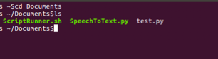

# BashScriptCall
A script used in Ubuntu to execute python scripts from different directories in new terminal windows. This script requires a bit of set up, below are instructions for setting up your workspace to accomodate for the these changes. Feel free to contribute to this code, the read me, or the project to make it better for others to use. 

<h2>Script to Run Python in New Windows (Ubuntu)</h2>

Open the terminal window and change directories to the directory containing the ScriptRunner.sh file 

<strong>GIVE THE SCRIPT EXECUTION PERMISSIONS</strong>
&nbsp;
Change execution permissions on file if necessary with:
&nbsp;
&nbsp;&nbsp;&nbsp;&nbsp;chmod u+x ScriptRunner.sh
